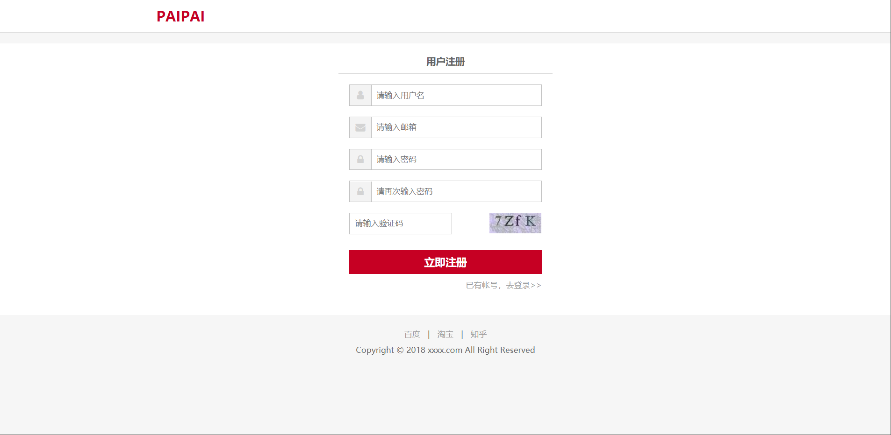
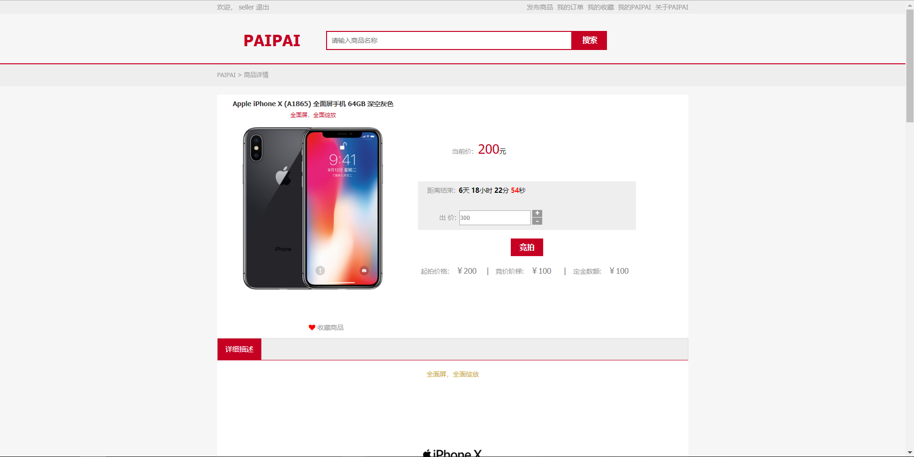

基于C2C的PAIPAI拍卖平台

**应用介绍：**

本应用是一个基于C2C（Customer To
Customer）的拍卖网站，用户可以在这上面发布或参与商品拍卖。

基本业务流程：

**技术使用：**

开发模式采用前后端分离的模式。

后台用Java编写，主要使用了Spring、Spring MVC 、Spring
Schedule、Mybaits、jedis等框架

服务器使用centos

服务器环境使用了nginx做代理服务器访问图片、redis存储应用缓存等

**主要模块：**

用户模块

商品模块

拍卖模块

订单模块

**用户模块包含**：登录注册、找回密码、信息更新、地址管理等功能

登录注册页面：

个人中心：

地址管理：

**商品模块包含**：收藏、搜索、竞拍等功能

搜索页面：

主要包含关键词搜索以及分类搜索等搜索方式

商品发布页面：

主要包含主图上传、用富文本编辑器simditor上传商品详情并发布

商品发布：

商品详情：

商品会根据商品状态显示当前出于拍卖状态还是结束状态，并且有对应的拍卖记录

竞拍中：

竞拍结束：

商品详情富文本内容：

详情页下的竞买记录：

收藏列表：

**拍卖模块包含：商品竞拍、拍品发布、定金支付、违约处理等**

商品竞拍：

定金支付：

：

**订单模块包含：订单管理、定时资金结算等主要业务功能**

包含对订单状态的管理并显示不同的操作。

订单列表：

订单详情：

